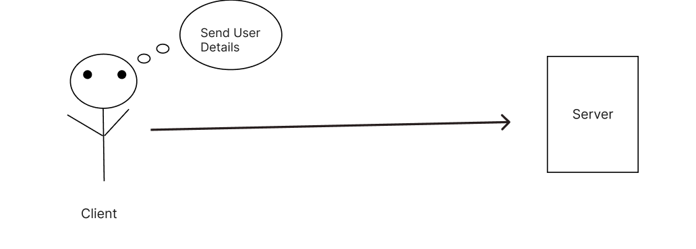
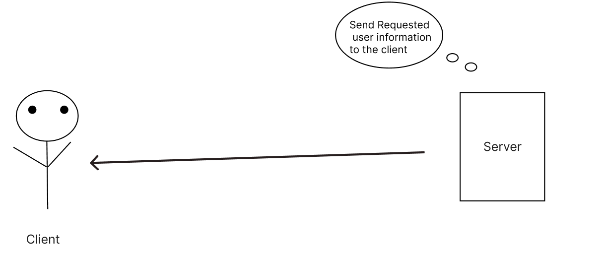

[](http://expressjs.com/)

- [What is NodeJs ?](#what-is-nodejs-)
- [What is Express ?](#what-is-express-)
- [What is Npm ?](#what-is-npm-)
  - [Npm install](#npm-install)
  - [Npm Remove](#npm-remove)
- [Express Syntax](#express-syntax)
  - [=\> In This Syntax:](#-in-this-syntax)


## What is NodeJs ?

- `NodeJs` hain Khoob Sara C++ Ka code jo ki Liya gaya hain Chrome browser ka V8 engine K code se aur is C++ Code Jisko liya gaya hain usey wrap kar diya gaya Js Code se or ye hame allow karta hain ke hum Js code likhein aur ye hame C++ k Basic par humlogo k liye server environment bana kar dega . par sirf tub tak jub tak node Chalu hain.

## What is Express ?

- ` Express.js `  ek powerful aur flexible web application framework hain jo Node.Js par based hain . Yeh Framework developers ko web application banane main madad karta hain server-side development ko simplify karta hain.
  
- Express ke through , hum  routes define kar sakte hain jo URL Par incoming requests ko sahi jagah redirect karta hain . Iske alawa Express.js middleware ka use karke request aur response ke beech ka interaction manage karne main asan karta hain.


## What is Npm ?

- `NPM ` pehle `Node package Manager` ke roop mein jaana jaata tha lekin ab iska koi official name nhi hain yeh generally NPM ke roop mein hi jaana jaata hain.

- Ye Pehle `Node.js ke package ko manage karne ke liye banaya gaya tha` lekin samay ke saath iska scope badh gaya hain . Ab Npm JavaScript Ecomsystem ke har type ke package aur liberies ko manage karta hain.

- Jaise frontend ` franework`,` tools `, `server side modules` aur bhi bahut kuch.
- Isse fronted developer ho ya Server-Side programming dono ko various development environment mein flexibility milti hain.
  

### Npm install 

```console
npm i FileName
```

- You can use -d flag to install file in developer dependence


### Npm Remove

```console
npm remove FileName
```


## Express Syntax
<a href="./03_Day_Express_Basic/03_StarterCode/ExpressSyntex">Express Syntex Code</a>


```js
const express = require('express')
const app = express()

app.get('/', function (req, res) {
  res.send('Hello World')
})

app.listen(3000) 

```

### => In This Syntax:

- `require('express')`  :  Ye Express module ko import krta hain  into our application.
- `const app = express()`   : It creates an instance of the express server and assigns it to a variable called "app".

- `app.get(''...)` is a function that define a route for handling incoming HTTP GET request  on specfic . 


- `function(req,res)` req or res dono parameters hain jp app.get ke callback function mein use hote hain

- req: ye client ki request se aane wale information ko represent karta hain. Jub koi user server ko koi cheez maangta hain,


<!--  -->




- res: ye client se aane wale request ka response karta hain , res mein wo data hota hain jo server client ko wapas bhejta hain . ye response ho skta hain koi specfic webpage,information ya kuch aur jo client ne maanga tha.


<!-- Image  -->


- `app.listen(PORT)` : ye server ko specfic port number par incoming request ko listen krne help kr ta hain.
