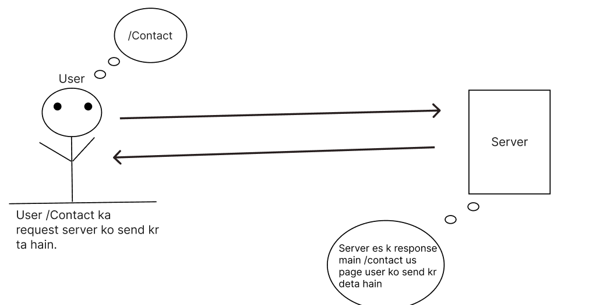
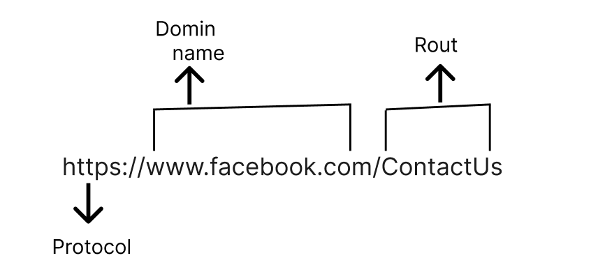
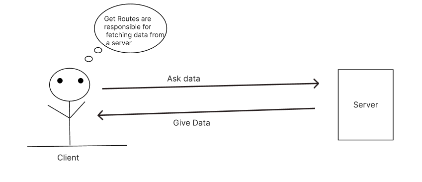

- [\* Routing in Express \*](#-routing-in-express-)
- [=\> What is Routing](#-what-is-routing)
  - [Example of Routing](#example-of-routing)
- [\* Types of routes \*](#-types-of-routes-)
  - [GET Routes](#get-routes)
  - [POST Route](#post-route)
  - [PUT Route](#put-route)


## * Routing in Express *

## => What is Routing

- Routing in Express.js meance deciding how Our Web Application  should respond When it gets a request at difference website address(URLs) it's like giving direction to the app on What to do When Someone visits a specific page.


###  Example of Routing 

- Sochiya aapko Web application hain aur aap 'Contact Us' Page ko handle karna chahte  ho. Toh aap Express mein routes define kar sakte hain. 


```JavaScript
app.get('/contact', function(req, res){
    res.send("Welcome to our Contact page");
})

```

- Yeh Code batata hain ki jab "/contact" Page par koi request aayegi , toh hum wahan "Welcome to our  Contact page" ka response bhejenge . Is tarah se hum alag-alag Page ke liye routes define karke , un par specfic action ko perform kar sakte hain.  

- Users Website ya web application ke pages ko visit karne ke liye apne ke address bar mein page ka URL type karke ya fir links ya buttons par click karke requests bhej sakte hain.

- Jaise ki agar kisi user ko koi specfic Page dekhna hain toh woh bas apne browser mein page ka URL (Jaise "www.example.com/contact) type karenge aur Server uska response main Corresponding Page ya data send kr dega.

- Usi tarah , users web application ke sath interact kar sakte hain buttons par click karke , form fill karke , ya link follow karke . In action se background mein server ko requests bheji jaati hain. Yeh requests information retrieve karne ke liye ho sakti hain (GET request) , form data submit karne ke liye Post request data update karne ke liye (PUT ya patch resqest ) ya request user intention ke hisaab se server ko send kr ta hain.
  
  
<hr/>
 

 ## * Types of routes *

 - In Express routes can be defined using HTTP methods like GET , POST , PUT , DELETE etc. These routes are defined in your Node.js application to handle different types of request.

1. Basic Routes

### GET Routes

- GET Routes ka istemal Hum apne data ka URL main dikhane ka liye karte hain Isme jab hum URL ko GET request ko visit kr te hain ya koi request ko server tak bhejte hain, tab woh data GET route ke zariye URL par dikhaya jata hain.
  
- GET route is like asking a server for information and deta . When you type a web address or click a link , you're essentiall making a "GET request" to the server , asking it to provide you with specific information , like a webpage or data , which then shows up in your browser.


```JAVASCRIPT

app.get('/user',(req,res)=>{
    res.send('User data')
})


```

 


### POST Route

- Post Routes woh route hota hain jiskaa upyog data ko URL mein nahi dikhane ke liye kiya jata hain. Yeh data ko Server ko bhejne ke liye prayog hota hain, jaise ki koi naya user ko banane ya koi nayi jaankari update karne ke liye.

- Post requests are used When you want to send data to the server to create or update something .
- They allow the server to received and process data from the client.

````JavaScript

app.post('/users/:id', (req,res)=>{
    res.send('Hello from user');
})
````

### PUT Route

- Put routes are used to update data on the server . These routes are particularly useful for modifying existing resources.


````JavaScript

app.put('/users/:id', (req,res)=>{
    res.send('Hello from user');
})
````