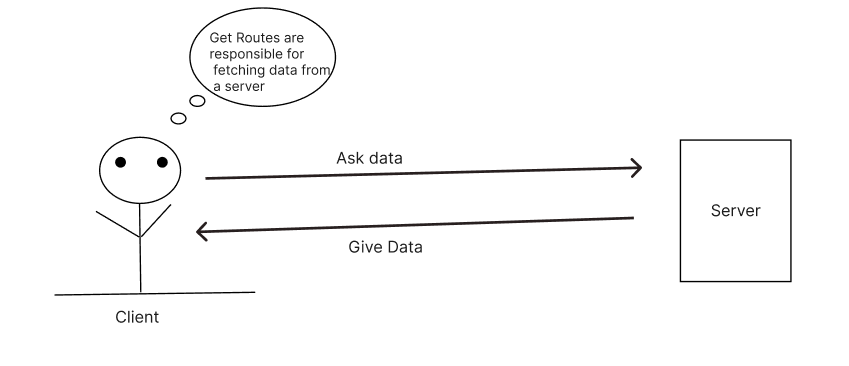

<!-- TOC -->

- [* Routing in Express *](#-routing-in-express-)
- [What is Routing](#what-is-routing)
    - [Example of Routingg](#example-of-routingg)
- [Types of routes](#types-of-routes)
    - [GET Routes](#get-routes)
    - [POST Route](#post-route)
    - [PUT Route](#put-route)
    - [app.delete](#appdelete)
    - [app.all](#appall)

<!-- /TOC -->

## * Routing in Express *

##  What is Routing

### English:
Routing in Express refers to how an application’s endpoints (URIs) respond when they receive requests from clients. It allows you to define the paths users can access in your application and determine how your server should respond to different HTTP requests, such as GET, POST, PUT, and DELETE. By setting up routes, you can manage different actions for different requests—like retrieving data, submitting forms, updating information, or deleting resources. Additionally, routing helps organize your code by separating the logic for different parts of your application, making it easier to maintain and understand. Overall, routing is essential for building interactive web applications where users can navigate between different pages and functionalities smoothly.

### Hinglish:
Express mein routing ka matlab hai ki ek application ke endpoints (URIs) client requests par kaise respond karte hain jab unhe requests milti hain. Yeh aapko yeh define karne ki suvidha deta hai ki users aapke application mein kaunse paths ko access kar sakte hain aur aapka server alag-alag HTTP requests, jaise GET, POST, PUT, aur DELETE par kaise respond karega. Routes set karne se aap alag-alag requests ke liye alag actions manage kar sakte hain—jaise data ko retrieve karna, forms ko submit karna, information update karna, ya resources ko delete karna. Iske alawa, routing aapke code ko organize karne mein madad karta hai, alag-alag parts ke liye logic ko separate karke, jis se aapka code maintain karna aur samajhna aasan ho jata hai. Overall, routing web applications banane ke liye zaroori hai jahan users alag-alag pages aur functionalities ke beech smoothly navigate kar sakte hain.


```javascript
app.METHOD(PATH, HANDLER)
```

### How to Define Routes?

In Express.js, routes are defined using methods associated with HTTP methods. Each method corresponds to a different type of request that can be made by the client.

#### 1. `app.get()`

**Usage:**
Handles GET requests, which are typically used to retrieve data from the server.

**When to Use:**
- When you want to fetch resources, such as retrieving a list of users or fetching a specific item from a database.

**Example:**
```javascript
app.get('/users', (req, res) => {
    // Code to fetch and return users
});

```

#### 2. `app.post()`

**Usage:**
Handles POST requests, which are generally used to submit data to the server, such as creating a new resource.

**When to Use:**
- When you want to create a new resource, like adding a new user or submitting a form.

**Example:**
```javascript
app.post('/users', (req, res) => {
    // Code to create a new user
});

```


#### 3. `app.put()`

**Usage:**
Handles PUT requests, typically used to update existing resources.

**When to Use:**
- When you want to update a specific resource, such as modifying a user's details.

**Example:**
```javascript
app.put('/users/:id', (req, res) => {
    // Code to update user with the given ID
});

```
#### 4. `app.delete()`

**Usage:**
 Handles DELETE requests, used to delete a specified resource.

**When to Use:**
- When you want to remove a resource from the server, like deleting a user.

**Example:**
```javascript
app.delete('/users/:id', (req, res) => {
    // Code to delete user with the given ID
});

```

#### 5. `app.all()`

**Usage:**
Handles all HTTP methods for a specific route.

**When to Use:**
- When you want to apply the same logic to different HTTP methods for a particular route, or for middleware functions.

**Example:**
```javascript
app.all('/users', (req, res) => {
    // Code to handle requests regardless of the HTTP method
});
```


#### 6. `app.use()`

**Usage:**
Used to define middleware, which are functions that execute during the request-response cycle.

**When to Use:**
- When you want to run code for every request, such as logging, authentication, or parsing request bodies.

**Example:**
```javascript
app.use((req, res, next) => {
    console.log('Request received:', req.method, req.url);
    next(); // Pass control to the next middleware
});
```


### Example of Routingg 

- Sochiya aapko Web application hain aur aap 'Contact Us' Page ko handle karna chahte  ho. Toh aap Express mein routes define kar sakte hain. 


```JavaScript
app.get('/contact', function(req, res){
    res.send("Welcome to our Contact page");
})

```

- Yeh Code batata hain ki jab "/contact" Page par koi request aayegi , toh hum wahan "Welcome to our  Contact page" ka response bhejenge . Is tarah se hum alag-alag Page ke liye routes define karke , un par specfic action ko perform kar sakte hain.  

- Users Website ya web application ke pages ko visit karne ke liye apne ke address bar mein page ka URL type karke ya fir links ya buttons par click karke requests bhej sakte hain.

- Jaise ki agar kisi user ko koi specfic Page dekhna hain toh woh bas apne browser mein page ka URL (Jaise "www.example.com/contact) type karenge aur Server uska response main Corresponding Page ya data send kr dega.

- Usi tarah , users web application ke sath interact kar sakte hain buttons par click karke , form fill karke , ya link follow karke . In action se background mein server ko requests bheji jaati hain. Yeh requests information retrieve karne ke liye ho sakti hain (GET request) , form data submit karne ke liye Post request data update karne ke liye (PUT ya patch resqest ) ya request user intention ke hisaab se server ko send kr ta hain.
  
  
<hr/>
 

##  Types of routes

 - In Express routes can be defined using HTTP methods like GET , POST , PUT , DELETE etc. These routes are defined in your Node.js application to handle different types of request.

1. Basic Routes

### GET Routes

- GET Routes ka istemal Hum apne data ka URL main dikhane ka liye karte hain Isme jab hum URL ko GET request ko visit kr te hain ya koi request ko server tak bhejte hain, tab woh data GET route ke zariye URL par dikhaya jata hain.
  
- GET route is like asking a server for information and deta . When you type a web address or click a link , you're essentiall making a "GET request" to the server , asking it to provide you with specific information , like a webpage or data , which then shows up in your browser.


```JAVASCRIPT

const express = require('express')
const app = express()

// respond with "hello world" when a GET request is made to the homepage
app.get('/', (req, res) => {
  res.send('hello world')
})


```

 


### POST Route

- Post Routes woh route hota hain jiskaa upyog data ko URL mein nahi dikhane ke liye kiya jata hain. Yeh data ko Server ko bhejne ke liye prayog hota hain, jaise ki koi naya user ko banane ya koi nayi jaankari update karne ke liye.

- Post requests are used When you want to send data to the server to create or update something .
- They allow the server to received and process data from the client.

````JavaScript

// POST method route
app.post('/', (req, res) => {
  res.send('POST request to the homepage')
})
````

### PUT Route

- Put routes are used to update data on the server . These routes are particularly useful for modifying existing resources.


````JavaScript

app.put('/users/', (req,res)=>{
    res.send('Hello from user');
})
````

### app.delete

Respond to a DELETE request to the /user route:

app.delete('/user', (req, res) => {
  res.send('Got a DELETE request at /user')
})

### app.all

- There is a special routing method, app.all(), used to load middleware functions at a path for all HTTP request methods. 

- For example, the following handler is executed for requests to the route “/secret” whether using GET, POST, PUT, DELETE, or any other HTTP request method supported in the http module.

```javascript

app.all('/secret', (req, res, next) => {
  console.log('Accessing the secret section ...')
  next() // pass control to the next handler
})


```


<!-- miidleWare folder main dalna hoga esko -->
<!-- 

### USE Route

- `app.use` is a method in Express.js that is used to mount middleware functions on the application's request processing pipeline. It adds middleware functions to the middleware stack, which are executed sequentially for every incoming request.


```javascript


const express = require('express');
const app = express();

// Middleware function
const myMiddleware = (req, res, next) => {
  console.log('This is middleware!');
  next(); // Move to the next middleware or route handler
};

// Adding middleware globally
app.use(myMiddleware);

// Route handler
app.get('/', (req, res) => {
  res.send('Hello World!');
});

app.listen(3000, () => {
  console.log('Server is running on port 3000');
});


``` -->
