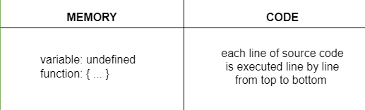

## JavaScript Execution Context

- When You run JavaScript Code the JavaScript Engine creates a  Execution Context.

- An Execution Context is a container that contains all the necessary information for the JavaScript code is Stored and the Code will be Executed Step by Step.


## Type Of Execution Context

- There are three types of Execution Context in JavaScript:

### 1. Global Execution Context

- Global Execution Context Created Automatically when the JavaScript Code is Run.

- Ye global Scope ko represent karta hai.

- In Browser, the Global Execution Context is the Window Object.

- In Node.js, the Global Execution Context is the Global Object.

```js
    console.log(this); // window
                    //   NodeJs Global
```

**What Does Global Execution Context Store**


- When The JavaScript Engine creates a Global Execution Context, it stores the following things:

    1. Global Object
    2. this
    3. Outer Environment
    4. Memory Component
    5. Code Component

**Global Object**

- The Global Object is a special object that is created by the JavaScript Engine.

- In the Browser, the Global Object is the Window Object.

- In Node.js, the Global Object is the Global Object.

- All the variables and functions that are created in the Global Execution Context are stored in the Global Object.


**this Object**

- In the Global Execution Context, the this keyword refers to the Global Object.

- In the Browser, the this keyword refers to the Window Object.

- In Node.js, the this keyword refers to the Global Object.

````js
    console.log(this); // window
                    //   NodeJs Global
````


- The Global Execution Context has two main components:

    1. Memory Component
    2. Code Component

2. Functional Execution Context

3. Eval Execution Context


## Two main components of an execution context

- The two main components of an execution context in JavaScript are:

1. Memory Component:
    - Memory Component is a place where all the variables and functions are stored in the memory.
    - When the JavaScript Engine creates an Execution Context, it also creates a Memory Component.
    - The Memory Component is also known as Variable Environment.

2. Code Component:
    - Code Component is a place where the JavaScript code is stored and executed
    - The Code Component is also known as Thread of Execution


    