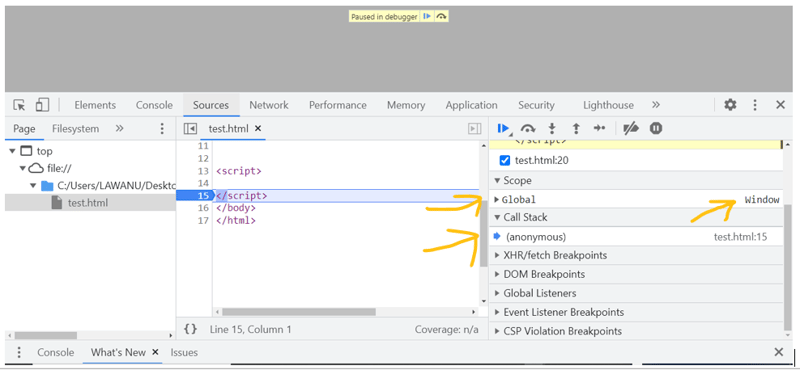
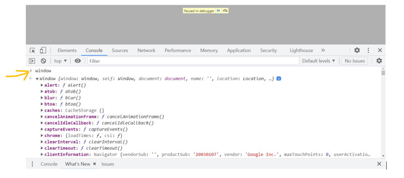

### Shortest Javascript Program , window and this 


```js
// No code
```


- The shortest JS Program is an empty program. When we run an empty Javascript code , a global execution context is created. The JS Engine sets up the global execution context and global memory space even though there is no code.


- In addition JS engine JavaScript engine creates a global object called "Window" in the browser environment, which contains global variables and functions.


- The global object can be accessed using the `Window` keyword or `this` keyword at the global level (or At global level, this === window).

```js
console.log(this === window); // true
```

- In different JavaScript Runtime Environments, the global object may have different names (e.g., window in browsers, global in Node. js).





### What is the `window` Object?

The `window` object is a global object that represents the browser window. It is the top-level object in the browser's JavaScript environment, and it is the global object for JavaScript code running in the browser. 



### What Does the `window` Object Contain?

The `window` object contains various **functions**, **variables**, **properties**, and **methods**. These are created in the **global memory space**, meaning you can access these variables and functions from anywhere in the JavaScript program.

- **Global Variables**: Variables declared globally become properties of the `window` object.
- **Global Functions**: Functions declared globally are also accessible as methods of the `window` object.


- **Properties and Methods**: Built-in properties and methods are attached to the `window` object, enabling interaction with the browser and its features.


### Key Features of the `window` Object:

1. **Global Variables & Functions**:

- Any variable declared in the global scope becomes a property of the `window` object. Similarly, functions declared globally become methods of the `window` object.


 Example:
 
```javascript
   var a = 10;
   function greet() {
     console.log("Hello from the global function!");
   }

   // Accessing the variable and function through window object
   window.a;          // 10
   window.greet();    // "Hello from the global function!"

```


2. **Built-in Global Functions:**


- The window object includes several useful global functions that are available in any JavaScript program running in a browser:

`alert()`: Displays an alert box to the user.

`console.log()`: Logs output to the console.

`setTimeout()`: Executes a function after a specified delay.

`setInterval()`: Repeatedly executes a function at regular intervals.


 Example:
 
```javascript
window.alert("Hello, World!");
window.console.log("This is a log message");
```


3. Interacting with the Browser Environment


- The `window` object provides access to the browser environment, allowing you to interact with the browser and its features. For example, you can access the browser's location, history, and document object through the `window` object.


`Manipulating the DOM (Document Object Model)` via window.document

`Managing the browser’s history` through window.history

`Accessing the current URL` with window.location


`Displaying alerts, prompts, and confirmations` with window.alert, window.prompt, and window.confirm

`Opening new browser windows or tabs` using window.open


`Storing data` using window.localStorage and window.sessionStorage

````js
window.document.title = "New Title";  // Change the document title
window.location.href = "https://www.example.com";  // Redirect to a new URL
window.alert("Hello, World!");  // Display an alert message
window.open("https://www.example.com");  // Open a new browser window


````

4. **Handling Events: **:  You can use the window object to add event listeners that respond to browser events like resizing the window, scrolling, or clicking:

```js
window.addEventListener("load", function() {
  console.log("Page loaded!");
});
```
