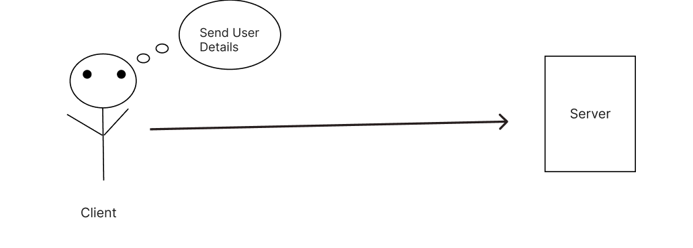
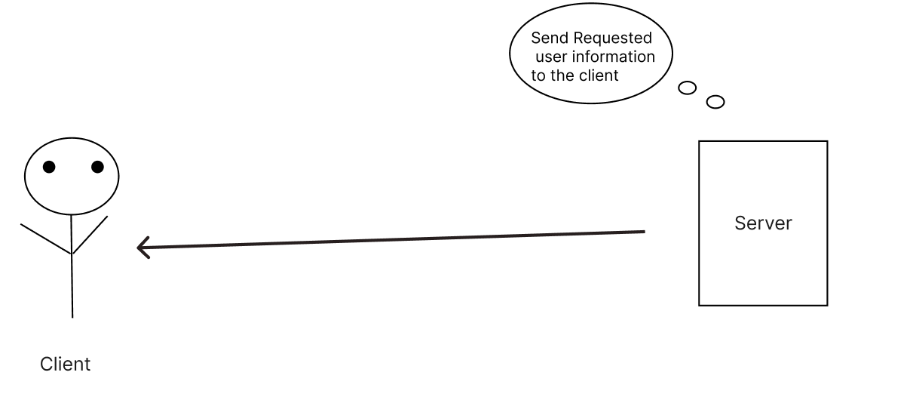

[](http://expressjs.com/)

- [What is NodeJs ?](#what-is-nodejs-)
- [What is Express ?](#what-is-express-)
- [What is Npm ?](#what-is-npm-)
  - [Npm install](#npm-install)
  - [Npm Remove](#npm-remove)
- [Express Syntax](#express-syntax)
  - [=\> In This Syntax:](#-in-this-syntax)


## What is a Framework?


 - A framework is a collection of pre-written code that provides a structure and tools for developers. It helps them build applications more easily by handling common tasks, so they can focus on creating the unique features of their software. This makes the development process faster and more organized.

- Framework ek pre-defined structure hota hai jo developers ko software applications banate waqt guidelines aur tools provide karta hai. Ye ek foundation ki tarah hota hai jisse aap apni application ke architecture ko design kar sakte hain. Frameworks generally common functionalities aur features ke saath aate hain, jisse developers ko basic tasks ko baar-baar likhne ki zaroorat nahi padti. Iska fayda ye hai ke aap apne kaam par focus kar sakte hain, jaise ki business logic aur user experience, bina infrastructure ke chinta kiye. Frameworks ka use karne se coding ka process faster aur organized hota hai, aur ye best practices ko follow karne mein bhi madad karte hain.


### Is a Framework Pre-Written Code?

Yes, a framework consists of pre-written code that provides a foundation for developers. It handles common tasks and helps developers build applications more easily, allowing them to concentrate on creating unique features.

## Benefits of Using a Framework

1. **Faster Development**: Since many common functionalities are pre-built, developers can complete projects more quickly.
   
2. **Organization**: Frameworks provide a structured way to organize code, making it easier to read and maintain.
   
3. **Best Practices**: They help ensure that developers follow best practices and industry standards, which can improve code quality.
   
4. **Community Support**: Popular frameworks often have large communities, meaning more resources, tutorials, and plugins are available.

## Examples of Frameworks

Here are some popular frameworks:

1. **Express.js**: 
   - A framework for building web applications using Node.js. It provides tools for setting up routes, handling requests, and managing middleware, making server-side application development easier.

2. **React**: 
   - A JavaScript library (often considered a framework) for building user interfaces. It helps developers create interactive and dynamic web pages by managing how components update and interact with each other.

3. **Django**: 
   - A web framework for Python. It includes built-in features for database management, user authentication, and URL routing, allowing developers to create complex web applications quickly.

4. **Ruby on Rails**: 
   - A framework for building web applications using the Ruby programming language. It emphasizes convention over configuration, providing sensible defaults to help developers get started faster.

5. **Angular**: 
   - A framework for building web applications using TypeScript. It provides tools for creating single-page applications, enabling a smooth user experience without full page reloads.

## Common Questions About Frameworks

1. **Why should I use a framework?**
   - Using a framework can speed up development, ensure code quality, and provide helpful tools and libraries that simplify complex tasks.

2. **Are all frameworks the same?**
   - No, different frameworks are designed for different purposes. For example, some are focused on web development (like Express.js), while others are for front-end interfaces (like React).

3. **Can I build applications without a framework?**
   - Yes, but it may take longer and require more effort to manage common tasks that frameworks handle automatically.

4. **How do I choose the right framework?**
   - Consider factors like the project requirements, community support, ease of use, and your familiarity with the programming language associated with the framework.


## What is NodeJs ?


- `NodeJs` hain Khoob Sara C++ Ka code jo ki Liya gaya hain Chrome browser ka V8 engine K code se aur is C++ Code Jisko liya gaya hain usey wrap kar diya gaya Js Code se or ye hame allow karta hain ke hum Js code likhein aur ye hame C++ k Basic par humlogo k liye server environment bana kar dega . par sirf tub tak jub tak node Chalu hain.

## What is Express ?

- Express.js is a lightweight web application framework for Node.js, designed to simplify the development of web applications and APIs. It provides a set of features for building web and mobile applications, allowing developers to create robust, scalable server-side applications efficiently.


- Express.js ek lightweight web application framework hai jo Node.js pe based hai. Ye web applications aur APIs ke development ko aasan banane ke liye design kiya gaya hai. Is framework ka main aim hai ki developers ko powerful server-side applications jaldi aur efficiently banane ki suvidha di jaye. Express web aur mobile applications banane ke liye features ka ek set provide karta hai, jisse developers mazboot aur scalable applications easily create kar sakte hain.

- Express ke through, hum routes define kar sakte hain jo URL par incoming requests ko sahi jagah redirect karte hain. Ye routing capabilities kaafi flexible hain; aap alag-alag HTTP methods (GET, POST, PUT, DELETE) aur URL paths ko manage kar sakte hain. Iska matlab hai ki jab koi user aapki website par specific URL visit karta hai, aap us URL ke liye specific functionality execute kar sakte hain.

- Express.js middleware ka use karke request aur response ke beech ka interaction manage karna asan hota hai. Middleware functions ko aap incoming requests par operations perform karne ke liye use kar sakte hain, jese logging (requests ka record rakhna), user authentication (ye check karna ki user valid hai ya nahi), aur error handling (agar koi problem aaye toh usse manage karna). Ye middleware code ko reusability aur modularity ka mauka deta hai, matlab aap ek baar likha hua code baar-baar use kar sakte hain.

- Iske alawa, Express mukhtalif template engines ko support karta hai, jaise Pug ya EJS, jo dynamic HTML pages generate karne mein madad karte hain. Iska matlab hai ki aapke web pages user input ya database se aaye data ke aadhar par badalte hain, jo user experience ko enhance karta hai. Express ko TJ Holowaychuk ne 2010 mein banaya tha, unhone is framework ko aasan aur efficient web application development ke liye design kiya tha.

- Express ki simplicity aur flexibility ki wajah se, ye rapidly grow hua hai aur ek badi community of users aur contributors bana chuka hai jo iski improvement aur features ko enhance karne mein kaam karte hain. Is framework ke mukhya objectives mein complexity ko kam karna, middleware support dena, robust routing capabilities provide karna, aur performance ko enhance karna shamil hai. Express high-performance applications ke liye perfect hai kyunki ye bohot saari simultaneous connections ko efficiently handle kar sakta hai, jisse aapki application fast aur reliable hoti hai.


## What is Npm ?


- `NPM ` pehle `Node package Manager` ke roop mein jaana jaata tha lekin ab iska koi official name nhi hain yeh generally NPM ke roop mein hi jaana jaata hain.

- Ye Pehle `Node.js ke package ko manage karne ke liye banaya gaya tha` lekin samay ke saath iska scope badh gaya hain . Ab Npm JavaScript Ecomsystem ke har type ke package aur liberies ko manage karta hain.

- Jaise frontend ` franework`,` tools `, `server side modules` aur bhi bahut kuch.
- Isse fronted developer ho ya Server-Side programming dono ko various development environment mein flexibility milti hain.
  


# Understanding package.json and npm

## What is package.json?

`package.json` ek khaas JSON file hai jo Node.js projects mein istemal hoti hai. Ye file kai important kaamon ke liye madadgar hoti hai:

`package.json` is a special JSON file used in Node.js projects that serves several important purposes:

1. **Project Information**: 
   - Ye file aapke project ki zaroori details rakhti hai, jaise:
   - This file contains essential details about your project, such as:
     - **Project Name**: Aapke project ka naam. 
     - **Version**: Aapke project ki current version (jaise 1.0.0). 
     - **Description**: Ek chhoti si line jo batati hai aapka project kya karta hai. 
     - **Author**: Wo vyakti ya team jinhone project banaya. 
     - **License**: Ye batata hai ki dusre is project ko kaise use kar sakte hain. 
     - **Keywords**: Aise shabd jo aapke project ko dhoondhne mein madad karte hain. 

2. **Dependencies**: 
   - Ye section un libraries ya tools ko list karta hai jo aapke project ko chalane ke liye zaroori hain.
   - This section lists the libraries or tools that are necessary for your project to run.
   - Jaise: `"express": "^4.17.1"` ka matlab hai ki aapka project Express library ko chahiye, aur ye 4.17.1 se lekar 5.0.0 tak koi bhi version use kar sakta hai. 
   - For example: `"express": "^4.17.1"` means your project needs the Express library, and it can use any version from 4.17.1 up to, but not including, 5.0.0.

3. **Scripts**: 
   - Aap yahan commands set kar sakte hain jo tasks automate karne mein madad karte hain. 
   - You can define commands here that help automate tasks.
   - Jaise: `"start": "node index.js"` aapko `npm start` likhkar application chalane deta hai. 
   - For example: `"start": "node index.js"` lets you run your app using `npm start`.

4. **Configuration**: 
   - Ye file project aur uski libraries ke liye settings rakhti hai.
   - This file holds configuration settings for the project and its libraries.

### Key Parts Explained

- **name**: Aapke project ka unique naam. Isay simple aur lowercase rakhein.
  
  **name**: The unique name of your project. Keep it simple and in lowercase.

- **version**: Ye project ki version dikhata hai, format hota hai MAJOR.MINOR.PATCH. 
  - Example: `1.0.0` pehla stable version hai.
  
  **version**: This shows the version of your project, formatted as MAJOR.MINOR.PATCH. 
  - Example: `1.0.0` is the first stable version.

- **description**: Chhoti summary jo batati hai aapka project kya karta hai.
  
  **description**: A short summary that tells what your project does.

- **main**: Wo main file jo run hoti hai jab aapka project start hota hai (jaise `index.js`).
  
  **main**: The main file that runs when your project starts (like `index.js`).

- **scripts**: Commands jo aap terminal mein chala sakte hain.
  
  **scripts**: Commands that you can run in the terminal.

- **author**: Aapka naam ya organization ka naam jo project maintain karti hai.
  
  **author**: Your name or the name of the organization maintaining the project.

- **license**: Project ke liye use hone wala license (jaise MIT).
  
  **license**: The license under which the project is used (like MIT).

- **dependencies**: Un libraries ki list jo aapke project ko chalane ke liye zaroori hain.
  
  **dependencies**: A list of libraries that are necessary for your project to run.

### Example of package.json

Yahan ek basic example diya gaya hai jo dikhata hai `package.json` file kaise hoti hai:

Here’s a simple example showing how a `package.json` file looks:

```json
{
  "name": "my-express-app",
  "version": "1.0.0",
  "description": "A simple Express.js application",
  "main": "index.js",
  "scripts": {
    "start": "node index.js",
    "dev": "nodemon index.js"
  },
  "author": "Your Name",
  "license": "MIT",
  "dependencies": {
    "express": "^4.17.1"
  }
}


<!--  -->

### Npm install 

```console
npm i FileName
```

- You can use -d flag to install file in developer dependence


### Npm Remove

```console
npm remove FileName
```


## Express Syntax
<a href="./03_Day_Express_Basic/03_StarterCode/ExpressSyntex">Express Syntex Code</a>


```js
const express = require('express')
const app = express()

app.get('/', function (req, res) {
  res.send('Hello World')
})

app.listen(3000) 

```

### => In This Syntax:

- `require('express')`  :  Ye Express module ko import krta hain  into our application.
- `const app = express()`   : It creates an instance of the express server and assigns it to a variable called "app".

- `app.get(''...)` is a function that define a route for handling incoming HTTP GET request  on specfic . 


- `function(req,res)` req or res dono parameters hain jp app.get ke callback function mein use hote hain

- req: ye client ki request se aane wale information ko represent karta hain. Jub koi user server ko koi cheez maangta hain,


<!--  -->




- res: ye client se aane wale request ka response karta hain , res mein wo data hota hain jo server client ko wapas bhejta hain . ye response ho skta hain koi specfic webpage,information ya kuch aur jo client ne maanga tha.


<!-- Image  -->


- `app.listen(PORT)` : ye server ko specfic port number par incoming request ko listen krne help kr ta hain.


# req or res
