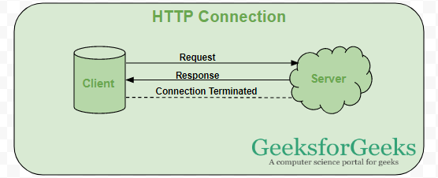

## What Socket.IO 


Socket.IO is a powerful library used for building real-time, bidirectional communication between web clients (like browsers) and servers. It is commonly used in web development for applications that require real-time data, such as chat applications, live notifications, collaborative tools, and more.

Socket.IO enables the server to send data to the client as soon as it's available, without requiring the client to repeatedly ask the server (which is called "polling"). This leads to faster and more responsive applications.


Socket.IO ek powerful JavaScript library hai jo web clients (jaise browsers) aur servers ke beech real-time, bidirectional communication establish karne ke liye use hoti hai. Ye real-time web applications ke liye specifically design ki gayi hai, jisme client aur server ke beech continuous interaction hoti hai. Iska istemal commonly web development mein un applications ke liye hota hai jahan real-time data ki zaroorat hoti hai, jaise chat applications, live notifications, collaborative tools (jaise Google Docs), online gaming, aur aur bhi kai interactive features.


### Key Features of Socket.IO

1. **Real-Time Communication:**

- Socket.IO allows the client and server to communicate in real-time, meaning both sides can send and receive data instantly. This is crucial for interactive applications where immediate feedback or updates are required, such as online messaging systems, notifications, or live updates.


- Socket.IO client aur server ke beech real-time communication enable karta hai, iska matlab hai ki dono taraf se messages instant send aur receive kiye ja sakte hain. Yeh feature interactive applications mein kaafi useful hai jahan real-time feedback ya updates ki zarurat hoti hai, jaise online messaging systems, notifications, ya live updates.

2. **Bidirectional:**

- Bidirectional communication means that data can flow in both directions—server to client and client to server. In traditional HTTP request-response models, only the client sends a request, and the server sends a response. However, in bidirectional communication, both the client and the server can actively send and receive data, without waiting for the other party to initiate the interaction.


- In Socket.IO, both the client and the server can exchange data in real-time. Whenever the server has new data, it can send it to the client immediately. Similarly, the client can notify the server whenever it performs an action. This enables real-time updates and interactions, which improves the performance and responsiveness of the application.

- In a chat app, when User A sends a message, it is sent from the client (browser) to the server, and the server instantly pushes this message to all other connected users. This back-and-forth communication continues without delay.

- Socket.IO bidirectional communication support karta hai, iska matlab hai ki client aur server dono independently messages bhej sakte hain bina ek dusre ke response ka wait kiye. Yeh traditional request-response models se alag hai, jahan server tabhi respond karta hai jab client request karta hai.

3. **Server Receives and Processes Events::**


- Both the client and server can emit and listen for events. This makes it easy to handle messages and actions on both ends.

- Socket.IO ek event-driven architecture follow karta hai, iska matlab hai ki client aur server dono events emit aur listen kar sakte hain. Yeh approach communication ko organize karne mein madad karti hai aur different types ke messages ya actions handle karna asaan banati hai.

4. **Automatic Reconnection**


-  If the connection is lost, Socket.IO automatically attempts to reconnect, reducing the need for manual intervention.

- Socket.IO mein ek built-in feature hota hai jo connection lost hone par automatic reconnect karne ki koshish karta hai. Isse network issues ya connection loss ke baad manual intervention ki zarurat nahi padti.

5. **Fallback Mechanisms**


- Socket.IO uses WebSockets by default, which provides a persistent connection. However, if WebSockets are not available (due to network restrictions or browser limitations), Socket.IO falls back to other communication methods, such as long polling, to ensure a stable connection..


- Socket.IO WebSocket connection use karta hai by default, jo ek persistent connection establish karta hai. Lekin agar WebSockets available nahi hote (network restrictions ya browser limitations ke wajah se), toh Socket.IO automatically long polling ya kisi aur communication method par fall back kar leta hai, taaki connection reliable rahe.

6. **Broadcasting:**

- Socket.IO allows the server to broadcast messages to multiple clients simultaneously, or to specific groups of clients known as "rooms." Broadcasting makes it easy to send notifications or messages to a large group of users at once.

- Socket.IO mein broadcasting ka feature hota hai jisme server ek hi message ko multiple clients ko bhej sakta hai, ya specific groups ko jo “rooms” kehlaate hain. Broadcasting kaafi useful hota hai jab aapko ek saath multiple users ko message bhejna ho.


## What is web socket and how it is different from the HTTP?


1. **Connection Establishment**

**`HTTP`** 

- HTTP request-response model par kaam karta hai. Jab client ko server se data chahiye hota hai, woh ek request bhejta hai, aur server response bhejta hai. Har request ke liye ek new connection establish hoti hai, jo response milte hi band ho jati hai.


-  HTTP operates on a request-response model. The client sends a request to the server, and the server responds. A new connection is established for each request and closed once the response is received.




**`WebSocket`** 


-   WebSocket connection ek baar establish hone par continuously open rehti hai. Jab client aur server WebSocket handshake complete kar lete hain, tab tak dono sides real-time mein data exchange kar sakte hain bina naye connections establish kiye.


- WebSocket establishes a persistent connection that remains open after the initial handshake. Once the WebSocket connection is established, both the client and server can continuously exchange data without the need for new connections.


## How WebSockets Work?

-  WebSocket works by establishing a communication channel through an HTTP handshake. Initially, the client sends an HTTP request with an Upgrade header, which tells the server that the client wants to switch from the HTTP protocol to the WebSocket protocol. Once the server accepts the WebSocket connection, it responds with a 101 status code, and the connection is established. After this, the client and server can freely exchange real-time data. Either party can then send a close frame to terminate the connection if needed.


- WebSocket ka kaam karne ka tareeka bahut simple hai. Jab client WebSocket connection establish karta hai, to pehle wo ek HTTP request bhejta hai jisme Upgrade header hota hai, jo server ko batata hai ki wo HTTP se WebSocket protocol mein switch hona chahta hai. Jab server WebSocket connection accept kar leta hai, to wo ek 101 status code ke saath response bhejta hai aur connection establish ho jata hai. Uske baad, client aur server aapas mein real-time data exchange kar sakte hain. Jab dono parties mein se koi bhi communication band karna chahe, to wo ek close frame bhej kar connection ko close kar sakte hain.


1. **Handshake:**

- The client sends an HTTP request with an “Upgrade” header to indicating that the client wants to establish a WebSocket connection.

- Sabse pehle client ek HTTP request bhejta hai jisme Upgrade header hota hai, jo server ko batata hai ki client WebSocket connection chah raha hai.


`Example HTTP Request:`

```makefile
GET /chat HTTP/1.1
Host: example.com
Upgrade: websocket
Connection: Upgrade
Sec-WebSocket-Key: dGhlbG9naW5nYm9vaw==
Sec-WebSocket-Version: 13

```


- `Upgrade:` websocket tells the server that the client wants to establish a WebSocket connection.
- `Sec-WebSocket-Key` is a random base64-encoded string used by the server to validate the handshake


2. **Server Response** 

- If the server supports the WebSocket protocol, it responds with HTTP status code 101 and switches to WebSocket communication.

- Agar server WebSocket protocol support karta hai, toh woh HTTP status code 101 bhejta hai, indicating that the connection has been successfully upgraded to a WebSocket connection.

`Example HTTP Response:`

```makefile
HTTP/1.1 101 Switching Protocols
Upgrade: websocket
Connection: Upgrade
Sec-WebSocket-Accept: s3pPLMBiTxaQ9kYGzzhZRbK+xOo=
```


3. **Establishing the WebSocket Connection**


- Once the handshake is complete, the client and server can exchange data in real-time using the WebSocket protocol. The connection remains open until either side decides to close it.

- Jab handshake complete ho jata hai, client aur server WebSocket protocol ke through real-time data exchange kar sakte hain. Connection tab tak open rehti hai jab tak koi side ise manually close nahi karta.

4. **Data Exchange**

- After the WebSocket connection is established, both the client and server can send messages to each other in real-time. The messages are sent as frames, which can be text or binary data.


- WebSocket connection establish hone ke baad, client aur server dono real-time mein messages exchange kar sakte hain. Messages frames ke form mein send kiye jate hain, jo text ya binary data ho sakte hain.


5. **Closing the Connection**

- Either the client or the server can close the WebSocket connection by sending a "close frame." The other side must then acknowledge it. Once both sides agree, the connection is fully closed.

- Kisi bhi waqt, client ya server ek close frame bhej kar WebSocket connection ko terminate kar sakte hain. Isse dono parties ko connection ko gracefully close karne ka option milta hai.


###  What Types of Data Can Be Sent Over WebSockets?


- WebSockets support two types of data: text and binary. Text data is typically used for sending messages, while binary data is used for more complex data types like images, audio, or video. The data is sent in frames, which contain the payload (text or binary data) and additional metadata.


### How is WebSocket Different from HTTP?


- HTTP is a request-response protocol where a new connection needs to be established for each interaction. On the other hand, WebSocket establishes a persistent connection that stays open between the client and server, making it more suitable for real-time communication. In HTTP, headers and data are repeated with each request, while in WebSocket, once the connection is established, the overhead is significantly reduced.

- HTTP ek request-response protocol hai jisme har interaction ke liye nayi connection establish karni padti hai. Jabki WebSocket ek persistent connection establish karta hai jo client aur server ke beech continuously open rehti hai, isliye WebSocket real-time communication ke liye zyada suitable hai. HTTP mein har request ke saath headers aur data repeat hote hain, jabki WebSocket mein ek baar connection open hone ke baad, ye overhead kaafi kam ho jata hai.

